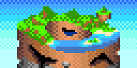
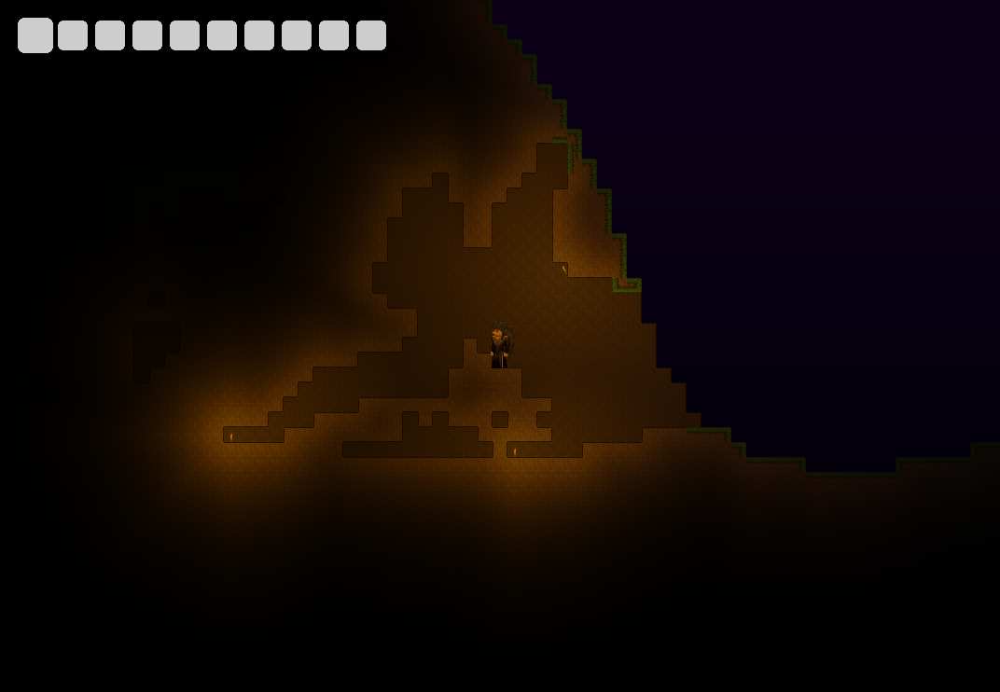
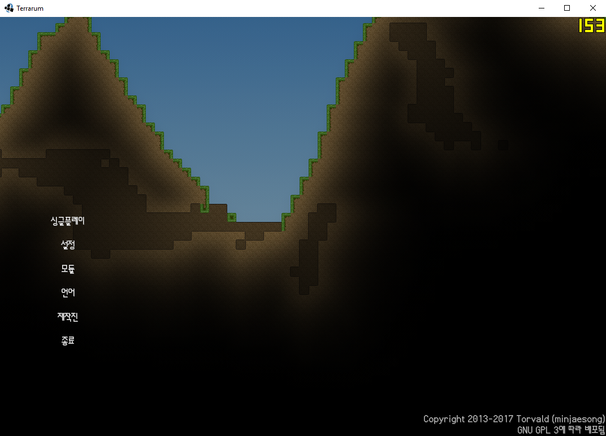
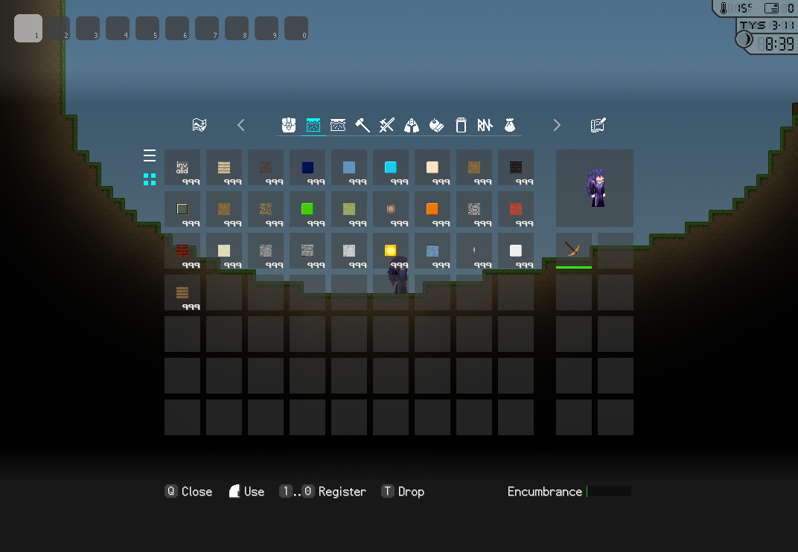
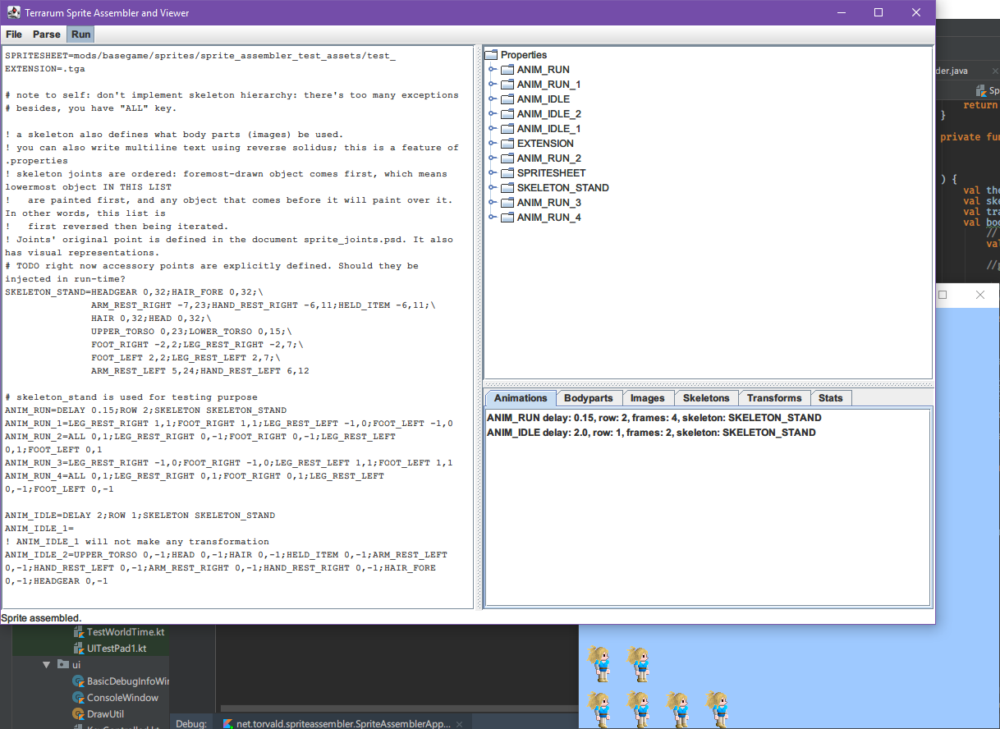

# Terrarum

The project is hosted on [GitLab](https://gitlab.com/minjaesong/terrarum). It hit the LFS size of the GitHub and I don't know how to reduce it...

...so, instead of actual code on this repo, here's some screenshots:

____

### 2015-12-31

The project, Terrarum (or Terrarum-renewed) started. (yes, there exists the even older version. In fact, this is 3rd iteration)

### 2016-02-05

First git commit.

### 2016-02-06

Tiles look connected when they are rendered.

____

*there's too much old commits, I won't put them here. Ah, one important commit:*

### 2016-10-23

A feature called Roundworld has implemented. The world is now topologicaly cylindrical, where eastern end of the world meets the western end, creating a loop along the X-axis.

____

### 2017-03-01

I'm on GPL bandwagon now!

### 2017-03-03

I'm on Git LFS bandwagon now!

### 2017-04-18

First implementation of the pickaxe.

### 2017-04-19

Large textures are getting GZipped.

### 2017-04-28

Quickslot re-implemented. This gets broken again in the future, when I moved from Slick2D to LibGDX, and not getting fixed because of its low prority.

### 2017-06-02

Blocks that are exposed to the light are drawn brighter than their actual light level, this improves aesthetics and playability. (looks prettier and ground more recognisable)

### 2017-06-22

I'm on LibGDX bandwagon now!

### 2017-07-05

Smooth lighting is achieved by a shader. Torch (it's not a candle!) casts realistic orange colour, which is based on my own colourimeter measurement. You'll be seeing more things with life-like colours such as this one in the future.

In the actual game, the torch flickers (gets brighter and darker) randomly, which mimics real-life fire.

### 2017-07-16

Skybox is dithered by the shader to remove banding artefacts.

### 2017-07-20

Vertical parallax scrolling (sky looks bluer as you go up)

### 2017-07-26

The titlescreen. This shows the main principal of the design — the minimalism. Fraps was open while taking the screenshot.

### 2017-11-07

One of the proposed inventory screen. May undergo some changes. 

### 2018-05-09

The inventory UI now scrolls.

### 2018-06-21

In-game features are now modularised: The base code (engine) and Module BaseGame. More modules will come.

### 2018-06-30

New set of renderers I call IngameRenderer is finally built and it's working.

### 2018-07-03

Postprocessor on the rendering engine.

### 2018-08-15

Experiments of parametric skybox model according to the paper *A Practical Analytic Model for Daylight*. Actual implementation has not been conducted.

### 2018-08-30

The titlescreen menus (called RemoCon) reworked, they're now more easily expandable.

### 2018-09-16

RNG is now serialisable (for saving/loading world). In-game font got its update

### 2018-10-09

Been testing with the world save/load and got them partially working.

### 2018-10-27

Xoroshiro RNG for everything, including the game's custom build Joise noise library.

### 2018-11-06

Established solid in-game calendar, 4 season-months, 120 days total, influenced from The World Calendar.

### 2018-11-10

Tile breakage now properly displays with the tiling shader.

### 2018-12-02

I'm on Gradle bandwagon now!

### 2018-12-08

Long-dreaded memory leak bug was caught. It's me not disposing 'temporary' GDX textures.

### 2018-12-29

Water now flows, thanks to [this article](https://w-shadow.com/blog/2009/09/01/simple-fluid-simulation/). Added the fluid layer. Removed water marker block.

### 2018-12-31

Platforms are implemented. (if you don't know what platform is, go play some Terraria, it's a great game)

### 2019-01-03

CSV editor was made

### 2019-01-04

Rudimentary sprite walk cycle

### 2019-01-07

The first output of Sprite Assembling: sprites can be assembled from bodyparts and Animation Description Language, using Skeletons and Transforms.

Still have more features to be implemented, but the most crucial parts are working as intended.

### 2019-01-15

Semitransparent-texture-on-semitransparent now renders correctly (e.g. Crude Glass will no longer render "cloudy with sky blue"), thanks to the new GDX version and my improved understanding on alpha; This game now strictly uses "Premultiplied Alpha", and PSD-to-TGA conversion script is also included (dependency: ImageMagick, Windows)

### 2019-01-20

Game implements Gdx's missing smooth deltaTime, by applying Kalman Filter on raw deltaTime.
